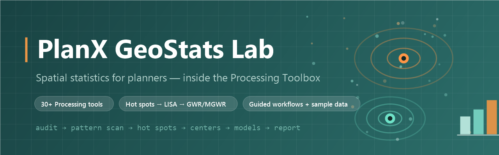

<div align="center">



# PlanX GeoStats Lab

**Spatial statistics for planners — inside the QGIS Processing Toolbox.**

[](https://github.com/YusufEminoglu/planx_geostats/releases)
[](LICENSE)
[](https://qgis.org)
[](https://docs.qgis.org/latest/en/docs/user_manual/processing/index.html)
[](https://github.com/YusufEminoglu/PlanX)

From *"is this clustered?"* to *"which model explains it?"* —
**30+ Processing algorithms covering the full spatial-statistics workflow, with guidance built in at every step.**

[Install](#-installation) · [Tool catalog](#-tool-catalog) · [Guided workflow](#-a-lab-not-a-toolbox-dump) · [Optional libraries](#-optional-libraries) · [Sample data](#-bundled-sample-data) · [Türkçe](#-türkçe-özet)

</div>

---

## ✨ Why GeoStats Lab?

| | |
|---|---|
| 🧭 **It guides, not just computes** | A **Workflow Advisor** recommends a tool sequence for your analysis goal; a **Data Readiness Audit** checks geometry validity, CRS risk, outliers and multicollinearity *before* you model. Every report explains assumptions, pitfalls and safer moves. |
| 📊 **Full method ladder** | Global pattern scans → local hot spots/outliers → centers & direction → OLS/GLR → spatial lag & error models → GWR/**MGWR** → model comparison → Monte Carlo sensitivity. One provider, one consistent reporting style. |
| 🧪 **Reproducible & honest** | Permutation inference where it matters, CSV/JSON exports for audit handoffs, and HTML analyst guidance attached to results — interpretation included, not implied. |
| 🏙 **Planner-first** | Bundled **İzmir neighbourhoods** dataset (237 polygons, heat/vegetation/population/park/street-network indicators) so every tool is try-able in one click. |
| 🔌 **Honest dependencies** | Core tools run on pure QGIS. Advanced methods (PySAL/MGWR/scikit-learn) are optional — a **Library Status** tool diagnoses the QGIS Python environment and a transparent installer previews the exact pip command before touching anything. |

---

## 🛠 Tool Catalog

All tools live under **Processing Toolbox → PlanX GeoStats Lab**, organised as a numbered workflow:

### `00` Setup & Diagnostics
GeoStats Library Status · Install/Update GeoStats Libraries · Sample Dataset Guide · **GeoStats Workflow Advisor** · **Data Readiness Audit**

### `01` Data Preparation & Neighborhoods
Export Attributes · Calculate Distance Band (neighbour-distance selection)

### `02` Urban Pattern Scan *(global statistics)*
| Tool | Question it answers |
|---|---|
| Average Nearest Neighbor | Are my points clustered or dispersed? |
| Ripley's K | …and at which distances? |
| Global Moran's I | Is the attribute spatially autocorrelated? |
| Incremental Spatial Autocorrelation | At what scale does clustering peak? |
| Getis-Ord General G | Do high or low values dominate the clustering? |
| Bivariate Lee's L | Do two indicators co-cluster in space? |
| **Spatial Inequality (Gini + Spatial Gini)** | How unequal is the distribution — and how much of that inequality is *spatial*? |

### `03` Hot Spots & Spatial Outliers *(local statistics)*
| Tool | Output |
|---|---|
| Hot Spot Analysis (Getis-Ord Gi\*) | Statistically significant hot/cold spots |
| Cluster & Outlier Analysis (Local Moran's I / LISA) | HH·LL clusters, HL·LH outliers |
| Multivariate Clustering | K-means feature groups across several indicators |
| Similarity Search | Features most similar to your reference feature |

### `04` Centers, Direction & Dispersion
Mean Center · Median Center · Central Feature · Standard Distance · Standard Deviational Ellipse · Linear Directional Mean

### `05` Models & Scenarios
| Tool | Method |
|---|---|
| Ordinary Least Squares | Baseline regression + residual diagnostics |
| Generalized Linear Regression | Gaussian/binary/count families |
| Exploratory Regression | Search candidate variable combinations |
| Spatial Lag Regression | Spatial dependence in the outcome |
| Spatial Error Regression | Spatial dependence in the residuals |
| GWR / **MGWR** | Local — and *multiscale* local — relationships |
| Model Comparison | Score competing models side by side |
| Monte Carlo Sensitivity Test | How robust is the result to perturbation? |

---

## 🧭 A lab, not a toolbox dump

The intended session is itself a method:

```text
00 Data Readiness Audit  →  02 pattern scan      →  03 hot spots / LISA
        ↓                        (is it clustered?)       (where exactly?)
   Workflow Advisor                                            ↓
   (pick the goal,        05 OLS → spatial lag/error → GWR/MGWR → comparison → sensitivity
    get the sequence)        (why? and is the "why" stable across space and noise?)
```

Each report ends with **interpretation guidance** — what the statistic assumes, what commonly goes wrong, and which tool to run next. The decision logic lives in QGIS-independent core helpers, so it is unit-tested headlessly on every release.

---

## 🔌 Optional Libraries

Core tools are pure QGIS. Advanced methods use, when present:

`libpysal` · `esda` · `spreg` · `mgwr` · `scikit-learn` · `numba`

> **The honest installer:** QGIS plugins run inside QGIS's own Python — installing into Anaconda or a system Python won't help. *GeoStats Library Status* shows exactly which interpreter QGIS uses and what's missing; *Install/Update GeoStats Libraries* previews the full pip command and only runs it after an explicit confirmation checkbox. Restart QGIS afterwards.

---

## 🗂 Bundled Sample Data

| Dataset | Contents | Use it for |
|---|---|---|
| **İzmir neighbourhoods** (`planx_geostats_izmir_neighborhoods.gpkg`) | 237 polygons; heat, vegetation, population, parks, street-network structure, building form, model-QA fields — English schema | Realistic end-to-end workflow practice |
| **Synthetic QA fixture** (`planx_geostats_synthetic_qa.gpkg`) | Deterministic point/line/polygon + model-output layers | Edge cases: KNN weights, multipart lines, binary/count models |

Load either (or both) via `00 → Sample Dataset Guide`, then run `Data Readiness Audit` for suggested analysis roles and starter sequences.

---

## 📦 Installation

**From QGIS Plugin Hub** *(recommended)*
> `Plugins → Manage and Install Plugins…` → search **PlanX GeoStats Lab** → Install. Tools appear in the **Processing Toolbox** (no toolbar/menu clutter — this plugin is Processing-only by design).

**From ZIP**
> Download the latest zip from [Releases](https://github.com/YusufEminoglu/planx_geostats/releases) → `Plugins → Install from ZIP`.

| Requirement | Value |
|---|---|
| QGIS | **3.28 LTR → 4.x** (validated on both runtimes) |
| Hard dependencies | None — pure QGIS for core tools |
| Optional | PySAL stack + scikit-learn via the built-in guided installer |
| License | [GPL-3.0](LICENSE) |

---

## 🧪 Quality

- **Headless smoke tests** (`tests/smoke_core.py`, `smoke_sample_data.py`, `smoke_provider_catalog.py`) run without QGIS and gate every release. The report decision logic is intentionally kept in **QGIS-independent core helpers**, so **workflow advising**, **model-comparison scoring**, **Monte Carlo sensitivity interpretation**, **Global Moran's I report interpretation** and **Spatial Gini inequality decomposition** are unit-tested without launching QGIS.
- A **full QGIS runtime matrix** executes every algorithm against the bundled sample data on **QGIS 3 LTR and QGIS 4**.
- A manual **QA test matrix** (`QA_MANUAL_TEST_MATRIX.md`) covers setup, statistics, symbology, report interpretation and release gates.
- The release-zip verifier asserts that **developer-only paths are absent**, **algorithm icons are present**, metadata points to a packaged icon, and the plugin remains **Processing-only** with no menu or toolbar UI hooks.

<details>
<summary><b>Developer validation commands</b></summary>

```powershell
py -3 planx_geostats\tests\smoke_core.py
py -3 planx_geostats\tests\smoke_sample_data.py
py -3 planx_geostats\tests\smoke_provider_catalog.py
py -3 packaging\test_verify_release_zip.py
py -3 packaging\validate_plugin.py planx_geostats --strict
powershell -NoProfile -ExecutionPolicy Bypass -File .\packaging\Build-PluginZip.ps1 -PluginDir planx_geostats
py -3 packaging\verify_release_zip.py QGIS_Plugin_Releases\planx_geostats.zip --root planx_geostats --version 0.9.17
```

</details>

---

## 🇹🇷 Türkçe Özet

**PlanX GeoStats Lab**, QGIS İşlem Araç Kutusu (Processing) içinde çalışan, plancılar için tasarlanmış bir **mekânsal istatistik laboratuvarıdır**:

- **30+ araç, numaralı iş akışı:** veri hazırlık ve denetim (00–01) → küresel desen taraması: Ortalama En Yakın Komşu, Ripley K, Global Moran I, General G, İki Değişkenli Lee L, **Mekânsal Gini eşitsizliği** (02) → sıcak nokta (Getis-Ord Gi*) ve **LISA** küme/aykırı analizi, çok değişkenli kümeleme, benzerlik araması (03) → merkez/yön/dağılım araçları (04) → EKK, GLR, mekânsal gecikme/hata modelleri, keşifsel regresyon, **GWR/MGWR**, model karşılaştırma ve Monte Carlo duyarlılık testi (05).
- **Yol gösteren laboratuvar:** *Workflow Advisor* analiz hedefinize göre araç sırası önerir; *Data Readiness Audit* modellemeden önce geometri, CRS, aykırı değer ve çoklu doğrusallık risklerini raporlar. Her raporun sonunda varsayımlar, sık hatalar ve "bundan sonra ne çalıştırmalı" rehberi vardır.
- **Örnek veri dahildir:** 237 mahalleli **İzmir** veri seti (ısı, bitki örtüsü, nüfus, park, sokak ağı göstergeleri) ve sentetik QA veri seti — her araç tek tıkla denenebilir.
- **Dürüst bağımlılık yönetimi:** Çekirdek araçlar saf QGIS ile çalışır; gelişmiş yöntemler için PySAL/MGWR/scikit-learn kurulumunu, çalıştırmadan önce pip komutunu aynen gösteren şeffaf bir kurulum aracı üstlenir.

Kurulum: QGIS → *Eklentiler → Eklentileri Yönet ve Kur* → **PlanX GeoStats Lab** aratın; araçlar İşlem Araç Kutusu'nda görünür.

---

## 🧩 Part of the PlanX ecosystem

This plugin is one of 15 open-source QGIS plugins for urban planning by the same author:

| Planning & analysis | CAD & production | 3D & visualization |
|---|---|---|
| [PlanX](https://github.com/YusufEminoglu/PlanX) — spatial-planning suite | [PlanX CAD Toolset](https://github.com/YusufEminoglu/PlanX-CAD) — drafting-grade CAD | [PlanX 3D City](https://github.com/YusufEminoglu/planx_3d_city) — Three.js city viewer |
| [GeoStats Lab](https://github.com/YusufEminoglu/planx_geostats) — spatial statistics | [EasyFillet](https://github.com/YusufEminoglu/EasyFillet) — tangent-arc fillet | [3D OSM Model](https://github.com/YusufEminoglu/osm_3d_model) — OSM → 3D city in browser |
| [Suitability Lab](https://github.com/YusufEminoglu/planx_suitability_lab) — raster MCDA | [Settlement Toolset](https://github.com/YusufEminoglu/PlanX-Settlement) — 9-stage settlement plans | [OSM Quick 3D](https://github.com/YusufEminoglu/osm_quick_3d) — OSM → native QGIS 3D |
| [DataCube Lab](https://github.com/YusufEminoglu/planx_datacube) — spatiotemporal cubes | [UIP Toolset](https://github.com/YusufEminoglu/PlanX-UIP) — Turkish master-plan automation | [Urban Procedural 3D](https://github.com/YusufEminoglu/planx_urban_procedural_3d) — parametric zoning lab |
| [Urban Resilience](https://github.com/YusufEminoglu/planx_urban_resilience) — 28 resilience tools | [ParcelFlux](https://github.com/YusufEminoglu/parcelflux) — parcel subdivision | [CartoLab](https://github.com/YusufEminoglu/planx_cartolab) — publication cartography |

---

## 🤝 Contributing & Support

- 🐛 **Bugs / requests** → [Issues](https://github.com/YusufEminoglu/planx_geostats/issues)
- 📜 **Changelog** → [CHANGELOG.md](CHANGELOG.md) follows *Keep a Changelog*
- ✅ Before a PR: `py -3 tests/smoke_core.py && py -3 tests/smoke_sample_data.py && py -3 tests/smoke_provider_catalog.py` (headless, no QGIS required)

## 👤 Author

**Yusuf Eminoğlu** — urban planner & developer
[GitHub](https://github.com/YusufEminoglu) · yusuf.eminoglu@deu.edu.tr

<div align="center">
<sub>Statistics with interpretation included. If GeoStats Lab sharpens your analysis, a ⭐ helps others find it.</sub>
</div>
